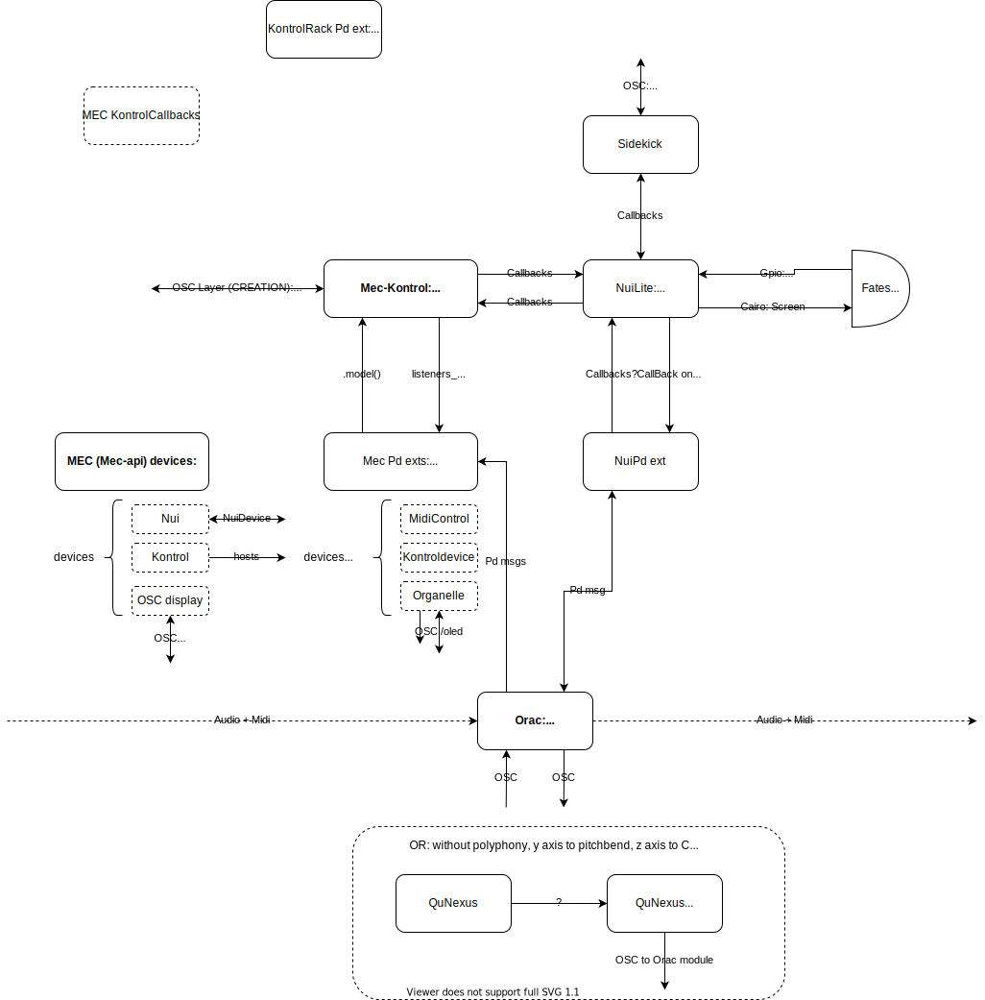

# Sound Docs

CPU swings.

## Repos:

General:

- Gisele sequencer: https://github.com/Lcchy/gisele
- Tadeusz granular synth: https://github.com/Lcchy/tadeusz
- Reverbs: https://github.com/Lcchy/verb
- FAUST Moog Ladder filter: https://github.com/Lcchy/moog_filter
- Dump of Pd patches and externals: https://github.com/Lcchy/pd-stuff

Fates:

- Install/Deploy script for Fates: https://github.com/Lcchy/fates-deploy
- Fates presets backup: https://github.com/Lcchy/fates-presets
- Orac Modules: https://github.com/Lcchy/orac-modules
- MEC fork from Technobear: https://github.com/Lcchy/MEC-private
- NuiLite fork from Technobear: https://github.com/Lcchy/NuiLite-private
- Eyesy for Fates: https://github.com/Lcchy/Eyesy_for_fates

Old:

- MaxMSP external for gesture recognition using knn classification: https://github.com/Lcchy/Gexture
- Audio visual source location and separation model: https://github.com/Lcchy/AVSep_NET
- DDSP sound synthetizer: https://github.com/Lcchy/DDSP

## Orac/Mec dev flow:

- Connect via ssh to fates
- (Git pull Mec on it + build (see mec docs))
- ```
  sudo systemctl stop sidekick
  cd sidekick
  /usr/local/sidekick/sidekick
  ```
- Launch Orac_dev from Fates hw

## Mappings:

Note: Midi Channel 0 is OMNI

- MIDI channels:

  - Eyesy : 9
  - Orac :

    - Chains: 1,2,3
    - Clock: In 1 - Out 1
    - Active module: 0-16 ?? TODO Check with Aux: 1 CC 69
    - Router EC4 control ([source](https://github.com/Lcchy/orac-modules/blob/main/fates_usermodules/router/aapart/parallel_dig_mult/module.pd)): 10 (CC 0 to 7)
    - Nui osc dev map ([source](https://github.com/Lcchy/orac-modules/blob/main/fates_usermodules/router/aapart/parallel_dig_mult/module.pd)): Ch 11
      - NRPN CC 98 99, 6 38 - Ids 00-Params#
      - ModuleSelect-PageSelect: CC 0-1

  - QuNexus LEDs: 1?

- OSC UDP ports:

  - Eyesy: 4000 and 4001 (and 4002 for foregd_mode)
  - MEC:

    - Kontrol (Creation, only used by Orac internally): r 6000 - s 6001
    - Nui OSC device ([source](https://github.com/Lcchy/MEC-private/blob/d872dcad8c574281ecfb098f9e593040da49c1e1/mec-api/devices/mec_nui.cpp#L503)): r 6100 - s 6101
    - Osc control interface device ([source](https://github.com/Lcchy/MEC_private/blob/ec310f15ff9f2f111efe796854457c43dc72ac80/mec-api/devices/mec_oscdisplay.cpp#L1442) - used for OracRemoteControl.pd, found [here](https://github.com/Lcchy/pd-stuff)): r 6100, s 6101

  - Sidekick ([source](https://github.com/Lcchy/NuiLite-private)): s 3000 and r 3001
  - Arc (see [doc](https://monome.org/docs/serialosc/osc/)):
  - Grid: ?

## Fates Orac/MEC Arch:

- Services (see fates-deploy):

  - There are 2 possible jack servers: runnning in `norns-jack.service` (on fates hw) or `digitakt-jack.service` (via overwitch-cli)
  - Spotify deamon running with `librespot`
  - Jack connections are managed via `jack-plumbing`
  - Orac can run with `orac` or `orac-jack` depending on the presence of a jack server
  - Usb mic connects via alsa_in in `usb-mic-jack`

  - Integrate Notes.md
  - Explain sidekick patches etc

## Jack routing:

(see .jack_plumbing)

```
; Eyesy connections

(connect "crone:output_1" "eyesy:input_1")
(connect "crone:output_2" "eyesy:input_2")

(connect "pure_data:output0" "eyesy:input_1")
(connect "pure_data:output1" "eyesy:input_2")

(connect "cpal_client_out:out_0" "eyesy:input_1")
(connect "cpal_client_out:out_1" "eyesy:input_2")

(connect "alsa_in:capture_1" "eyesy:input_1")
(connect "alsa_in:capture_2" "eyesy:input_2")

; Digitakt - Stereo

; (connect "alsa_in:capture_1" "system:playback_1")
; (connect "alsa_in:capture_2" "system:playback_2")

(connect "alsa_in:capture_1" "pure_data:input0")
(connect "alsa_in:capture_2" "pure_data:input1")

(connect "alsa_in:capture_1" "crone:input_1")
(connect "alsa_in:capture_2" "crone:input_2")

(connect "crone:output_1" "alsa_out:playback_1")
(connect "crone:output_2" "alsa_out:playback_2")

(connect "pure_data:output0" "alsa_out:playback_1")
(connect "pure_data:output1" "alsa_out:playback_2")

; Digitakt - Multitrack - paralell_dig_mult router

(connect "cpal_client_out:out_0" "Digitakt:Main L Input")
(connect "cpal_client_out:out_1" "Digitakt:Main R Input")

(connect "Digitakt:Main L" "pure_data:input2")
(connect "Digitakt:Main R" "pure_data:input3")

(connect "Digitakt:Track 6" "pure_data:input4")
(connect "Digitakt:Track 7" "pure_data:input5")
(connect "Digitakt:Track 8" "pure_data:input6")

(connect "pure_data:output0" "Digitakt:Main L Input")
(connect "pure_data:output1" "Digitakt:Main R Input")

; MIDI

(connect "a2j:Faderfox EC4 \[._\] \(capture\): \[0\] Faderfox EC4 MIDI 1" "a2j:Pure Data \[._\] \(playback\): \[0\] Pure Data Midi-In 1")
(connect "Digitakt:MIDI out" "a2j:Pure Data \[.\*\] \(playback\): \[0\] Pure Data Midi-In 1")
```


